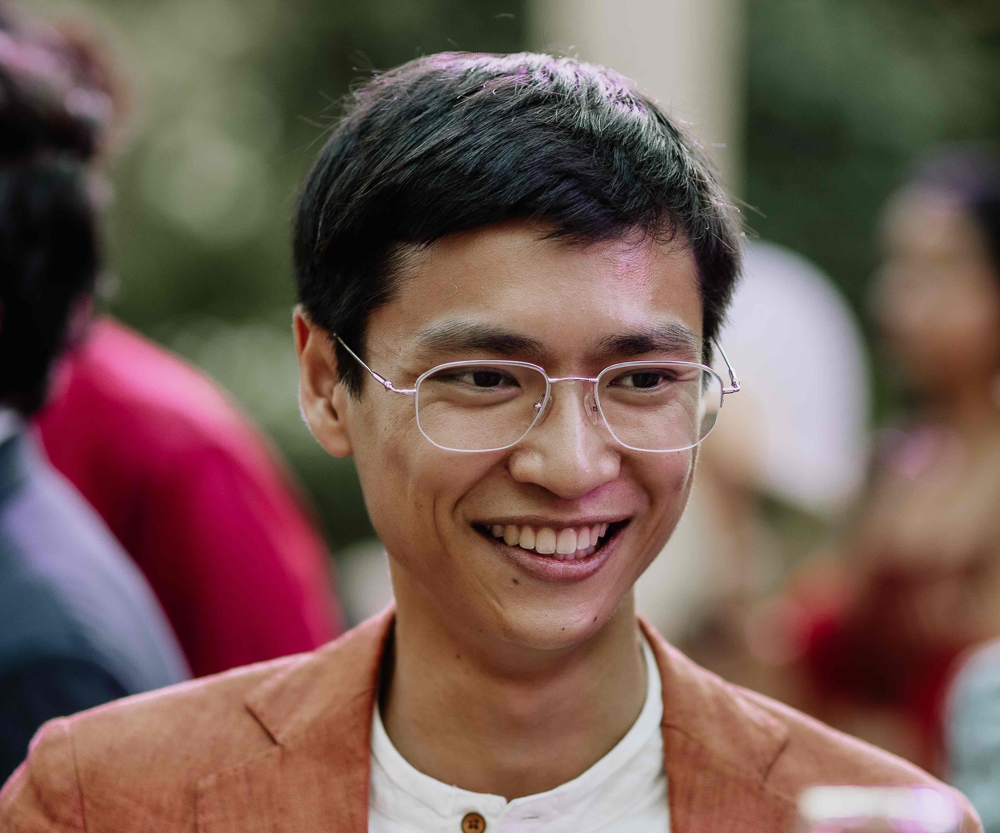

Brunston Poon
=============

Space Infrastructure Software Engineer, **[Loft Orbital](https://www.loftorbital.com/)** \| Assistant Carillonist, **[UC Berkeley](https://music.berkeley.edu/sather-tower-carillon/)**

* *Carillonneur titulaire* de Castelnaudary, France
* B.S. Electrical Engineering and Computer Science, UC Berkeley (2020)
* Carillonneur Member, Guild of Carillonneurs in North America (advancement year 2020)

Additional Links
================

[LinkedIn](https://linkedin.com/in/brunston) - [Github](https://github.com/brunston)

[YouTube](https://www.youtube.com/@brunston) - [Instagram](https://www.instagram.com/brunstonbrunston/)

Upcoming Carillon Concerts
==========================
To be announced...

Selected Recent Carillon Concerts
========================

* [A full listing of past carillon concerts is available here.](https://brunston.net/carillon/)
* [2025-05-18, Notre-Dame, Villefranche-de-Rouergue](https://www.ladepeche.fr/2024/05/16/concert-de-jazz-au-carillon-de-la-collegiale-notre-dame-samedi-11954060.php)
* 2024-04-14, Collégiale Saint-Michel, Castelnaudary (Aude), France
* [2024-01-01, New Year's Day Midnight Concert, UC Berkeley Sather Tower, Berkeley, California](https://www.instagram.com/reel/C1laxQJr05Z/?utm_source=ig_web_copy_link&igsh=MzRlODBiNWFlZA==)
* 2023-11-26, Collégiale Saint-Michel, Castelnaudary (Aude), France
* [2023-10-22, Notre-Dame, Villefranche-de-Rouergue (Aveyron), France](http://amiscarillonvfr.blogspot.com/2023/10/concert-dimanche-22-octobre-15h-17h.html)
* [2023-08-12, 9th Berkeley Carillon Festival, UC Berkeley Sather Tower, Berkeley, California](https://bells.berkeley.edu/#events)
* [2023-08-06, UC Santa Barbara Storke Tower, Santa Barbara, California](https://campuscalendar.ucsb.edu/event/summer_carillon_brunston_poon080623?utm_campaign=widget&utm_medium=widget&utm_source=UC+Santa+Barbara) ([program](../assets/2023-08-06_ucsb_recital_program_brunston_poon_and_berkeley_carillon_guild.pdf))
* 2023-07-30, UC Berkeley Sather Tower, Berkeley, California (with Erika Anderson, Anna Zhao, & Michelle Pan)
* [2023-06-14, GCNA Congress 2023, St. Stephen's Church, Cohasset, Massachusetts (with Erika Anderson)](https://www.gcna.org/2023-Congress) ([program](https://www.gcna.org/resources/Documents/2023-Congress-Cohasset-Program-6_9_23_corrected.pdf))
* 2023-06-04, UC Berkeley Sather Tower, Berkeley, California (with Peter Trost and Anna Zhao)
* [2023-03-12, Notre-Dame, Villefranche-de-Rouergue (Aveyron), France](https://www.centrepresseaveyron.fr/2023/03/07/concert-de-carillon-avec-brunston-poon-carillonneur-americain-11044816.php)
* 2022-12-31, Midnight New Year's Concert, UC Berkeley Sather Tower, Berkeley, California
* 2022-12-11, Holiday Concert, UC Berkeley Sather Tower, Berkeley, California
* [2022-10-30, Notre-Dame, Villefranche-de-Rouergue, Aveyron, Occitanie, France](https://villefranche-de-rouergue.fr/agenda/concert-de-carillon-3/)
* 2022-10-23, Notre-Dame-de-la-Drèche, Albi (Tarn), France
* [2022-10-09: Journées nationale du carillon, Basilique Saint-Sernin, Toulouse, France](https://actu.fr/occitanie/toulouse_31555/toulouse-voici-pourquoi-les-cloches-de-saint-sernin-vont-sonner-trois-quarts-d-heure-dimanche_54358170.html)
* 2022-10-08: Journées nationale du carillon, Notre-Dame-de-la-Platé, Castres (Tarn), France

Past
====

* **UC Berkeley**, Associate Carillonist, 2021-2023
* **Loft Orbital**, Software Engineering Intern, 2020 SU
* **Google**, Software Engineering Intern, YouTube Gaming, 2019 SU
* **Boeing** Commercial Airplanes, Cybersecurity Intern, 2018 SU
* The **[mtwshngtn](https://mtwshngtn.github.io/)** project
* **SpaceX**, Avionics Intern, Avionics Test Engineering, 2018 SP
* Co-founder, **[Fanalytical Solutions](http://fanalyticalsolutions.com)**, 2017-2019
* **[CalSTAR](https://stars.berkeley.edu) high-power rocketry @ UC Berkeley**, VP / Payload Co-Lead 2017-2018
* **Lockheed Martin** SSC Advanced Technology Center, Software / Electrical Engineering Intern, 2017 SU
* **Lockheed Martin** Space Systems Company, Systems Engineering Intern, 2016 SU
* **[stellarPYL](http://brunston.net/stellarpyl)** - stellar spectra reduction and analysis software in python
* **St. Paul's School**, Form of 2016.
